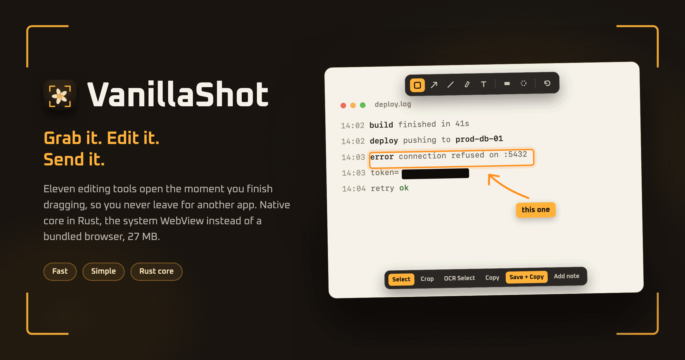
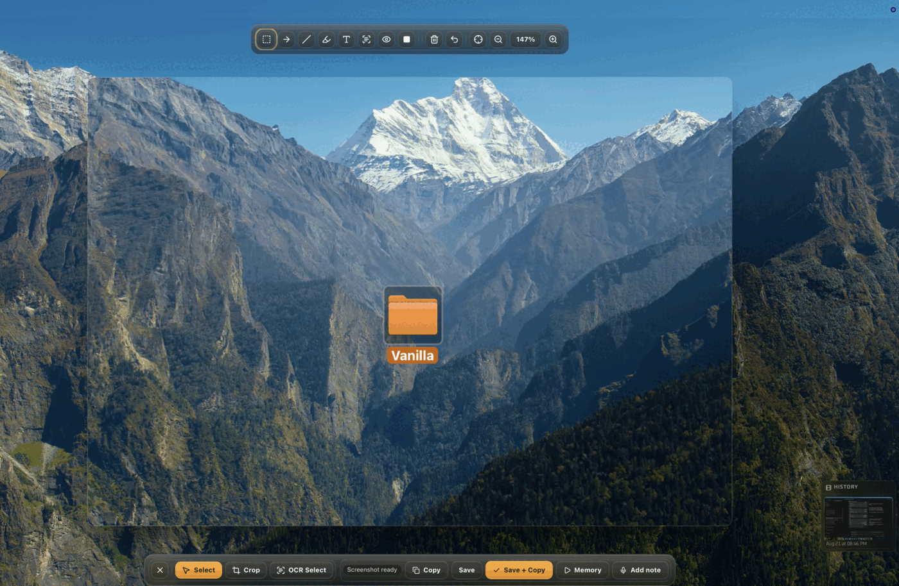

<p align="center">
  
</p>

# VanillaShot

A fast screenshot tool for macOS. Grab a region, edit it on the spot, send it.
No account, no subscription, no upload, no nagging.

The editor is the point. Eleven tools, a keystroke each, on a canvas that opens
the moment you let go of the mouse. Everything else in the app exists to save
you a step: dictate a note instead of typing it, copy text straight out of an
image, or find a screen you saw an hour ago.

Free and open source, and it stays that way.

Author: martinezooo, hack-jitsu.com

> **Status: pre-1.0.** macOS only, Apple silicon only, and there is no signed
> download. You build it from source.

## Contents

- [Why](#why)
- [Capture](#capture)
- [The editor](#the-editor)
- [Voice notes](#voice-notes)
- [Text in your screenshots](#text-in-your-screenshots)
- [Secrets, caught before you send](#secrets-caught-before-you-send)
- [QR codes and barcodes](#qr-codes-and-barcodes)
- [Screen memory](#screen-memory)
- [Requirements](#requirements)
- [Install](#install)
- [Permissions](#permissions)
- [Where files go](#where-files-go)
- [Keyboard shortcuts](#keyboard-shortcuts)
- [Deep links](#deep-links)
- [Raycast extension](#raycast-extension)
- [Privacy](#privacy)
- [Development](#development)
- [License](#license)

## Why

Good screenshot tools on macOS are paid. The free ones stop at taking the
picture, so you end up opening a separate editor to draw one arrow. VanillaShot
tries to be the tool you would have paid for, without the price tag and without
sending your screen to anyone.

It is a menu-bar app. No Dock icon, no window in your way, no launch screen.

## Capture

Press `Cmd+Shift+1` and drag.

The screen freezes the instant you press the shortcut, so menus stay open,
video stops moving, and you can aim at something that would normally vanish.
The app hides itself first, so it never lands in its own screenshot. `Esc`
cancels.

The editor opens right where you finished dragging.

## The editor

<p align="center">
  
</p>

Eleven tools: select, crop, arrow, border, text, highlight, strike, blur,
pixelate, blackout, and OCR-select.

They behave the way you expect. Drag to draw, drag a handle to resize, `Cmd+Z`
to undo. `Cmd+S` saves a PNG, `Enter` saves and copies it to the clipboard in
one go, and `Cmd+C` copies the selection.

Nothing is destructive until you export, so you can move a blur after you have
drawn it.

## Voice notes

Attach a note to a screenshot by talking instead of typing. Transcription runs
as you speak, so you can watch the text appear and stop when it is right.

The recording never touches the disk. Only the finished text is saved, as a
`.txt` file next to the image.

## Text in your screenshots

Every new screenshot is read automatically, offline, with a bundled OCR engine.

That gives you two things. Use the OCR-select tool to grab text out of an image
the way you would from a web page, which is handy for error messages and
terminal output that you cannot copy from. And it is how the app knows what is
in the picture, which the next section builds on.

## Secrets, caught before you send

The recognised text is scanned for things that should not leave your machine:
cloud keys, CI and forge tokens, JWTs, private key blocks, password hashes,
addresses, emails, and values sitting next to words like `password`. One click
blacks out everything it flagged.

Masking is always blackout, never blur. A blurred region can still carry enough
contrast to be recovered, and a blurred barcode often still scans.

Treat it as a safety net rather than a guarantee. Look at the picture before
you send it.

## QR codes and barcodes

Every screenshot is scanned for codes automatically, the moment it loads. You
do not press anything. A screenshot of a 2FA enrolment code gives away the seed
just as completely as pasting it, and that is easy to forget when the code is
just a small square in the corner of a window.

QR, Micro QR, rMQR, DataMatrix, Aztec, PDF417, Code 128, Code 39, EAN-13 and
ITF are all decoded on your machine.

Each code found is outlined on the image and listed with what it contains and
why that matters:

- **critical** for TOTP and HOTP seeds, Wi-Fi credentials, URLs with credentials
  in them, and private key material
- **sensitive** for links, contact cards, email addresses, phone numbers, and
  any scheme the app does not recognise
- **benign** for the rest

From there you either mask one code or click **Mask all sensitive**, which
covers everything that is not benign in one go. Critical payloads stay hidden
behind a Reveal button, and stay out of the clipboard until you reveal them.

### Decoded payloads are treated as inert data

A payload from a barcode is attacker-controlled by definition. Anyone who gets
you to screenshot their QR code chooses those bytes. So a decoded payload is
never opened, never executed, and never put anywhere it could be interpreted:

- It is shown as text and copied on request. There is no Open button, no
  `window.open`, no link, and nothing hands it to the system opener.
- The app ships no shell or opener plugin at all, so the webview has no way to
  launch anything. The two places that do call `/usr/bin/open` pass a fixed
  URL compiled into the binary and take no argument from the page.
- It never reaches a filename or a path. Exports are named from the process id
  and a timestamp in a fixed folder.
- Invisible characters are shown escaped, so a payload cannot use a
  right-to-left override to display one address while encoding another.

The same holds for OCR text, which is equally attacker-controlled.

## Screen memory

An optional background recorder that gives you a searchable history of your
screen, for when you closed something an hour ago and wish you had not.

It saves a screenshot every 10 seconds, reads each one with OCR, and puts the
text in a search index. A low-rate video track is kept alongside them, so the
frames have context. Search finds the moment, and you get the frame.

It is off until you switch it on. When it runs, it is broad, so here is the
whole picture:

| | |
| --- | --- |
| Captures | your entire primary display. No window is excluded. |
| Screenshots | one JPEG every 10 seconds, each one OCR'd into a full-text index |
| Video | H.264 at 5 fps, about 1 Mbps, in 5-minute segments |
| Location | `~/Library/Application Support/com.hackjitsu.vanillashot/` |
| Retention | 30 days by default |

Two things worth knowing before you turn it on:

- **It records VanillaShot too.** Open a screenshot in the editor while it runs
  and the unredacted original goes into the index before you redact it.
- **The store is not encrypted.** It is ordinary SQLite and video files. Any
  process running as you can read them. Delete the folder to purge it.

Two known gaps: the 30-day cleanup only advances while recording is on, and
there is no "delete everything" button yet.

## Requirements

| | |
| --- | --- |
| macOS | 12.3 or newer |
| Hardware | Apple silicon only. There is no universal or Intel build. |
| Node | 20.19+ or 22.12+ |
| Rust | stable toolchain |
| Xcode | Command Line Tools, for `swiftc` |

```bash
xcode-select --install
curl https://sh.rustup.rs -sSf | sh
```

## Install

There is no signed or notarised download. A build made without an Apple
Developer ID certificate is blocked by Gatekeeper, so posting a DMG would only
teach people to click past security warnings. Build it yourself:

```bash
git clone https://github.com/martinezooo/VanillaShot.git
cd VanillaShot
npm install
npm run install:local
```

That builds the app, signs it with a certificate from your keychain, and
installs it to `/Applications/VanillaShot.app`. A free Apple Development
certificate from Xcode is enough.

The signing step matters. An ad-hoc signature carries no certificate, so macOS
identifies the app by its code hash, and every rebuild looks like a new app that
has to be granted Screen Recording again. Set `VANILLASHOT_SIGN_IDENTITY` if the
script picks the wrong certificate.

## Permissions

**Screen Recording is required.** Nothing works without it, and macOS returns
blank images rather than an error when it is missing.

Grant it in **System Settings > Privacy & Security > Screen Recording**, then
restart the app. macOS only re-reads the grant at launch. Settings shows you
the real state without triggering a prompt.

Microphone and Speech Recognition are asked for only when you start dictating a
note.

## Where files go

Screenshots land in `~/Pictures` as `vanilla-shot-<pid>-<timestamp>.png`. The
folder is shown in Settings. A note is saved as a `.txt` file next to its image.

## Keyboard shortcuts

| Key | Action |
| --- | --- |
| `Cmd+Shift+1` | capture a region (also `Ctrl+Shift+1`) |
| `Enter` | save the PNG and copy it |
| `Cmd+S` | save the PNG |
| `Cmd+C` / `Cmd+X` | copy / cut the selection |
| `Cmd+Z` | undo |
| `Delete` / `Backspace` | delete the selection |
| `Esc` | cancel the capture, or clear the selection |

## Deep links

The app registers `vanillashot://`. The verb set is fixed and takes no
payloads, so there is nothing to parse.

| URL | Action |
| --- | --- |
| `vanillashot://capture` | capture a region |
| `vanillashot://show` | show the main window |
| `vanillashot://memory/start` | start screen memory |
| `vanillashot://memory/stop` | stop screen memory |
| `vanillashot://memory/toggle` | flip screen memory |

## Raycast extension

`raycast/` holds an extension with three commands: Capture Region, Toggle Screen
Memory, and Search Screen Memory. See [raycast/README.md](raycast/README.md).

## Privacy

VanillaShot makes no network requests. No telemetry, no analytics, no crash
reporting, no updater, and no HTTP client in the binary. Capture, OCR, barcode
decoding and redaction all run on your machine, and the OCR model, the barcode
decoder and the UI font are bundled rather than fetched.

The thing to watch is not the network but the local disk. Screen memory is
stored unencrypted, and any local process can open a `vanillashot://` link,
including one that starts recording.

## Development

```bash
npm install
npm run dev           # editor in a browser, no desktop features
npm run tauri:dev     # full desktop app (menu bar, no window opens)
npm run tauri:build   # bundle into src-tauri/target/release/bundle
npm run install:local # build, sign, install to /Applications
npm run lint
```

See [CONTRIBUTING.md](CONTRIBUTING.md) for conventions.

## License

MIT. See [LICENSE](LICENSE).

Bundled third-party components are listed in
[THIRD-PARTY-NOTICES.md](THIRD-PARTY-NOTICES.md).
